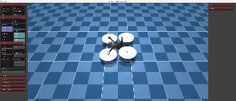

# Skydio X2 in Mujoco

Using the mujoco_menagerie repo, I let the drone out of its cage.

## Getting started
Set-up MuJoCo and the requirements. Then, simply run main.py

## To-Dos
Here are some To-Dos of this project:

- Improve PID controllers
- Add a "real" sensor and state estimator
- Add a "real" trajectory planner

## Acknowledgements
Mujoco: https://github.com/google-deepmind/mujoco
Mujoco Menagerie: https://github.com/google-deepmind/mujoco_menagerie
Simple PID: https://github.com/m-lundberg/simple-pid/tree/master